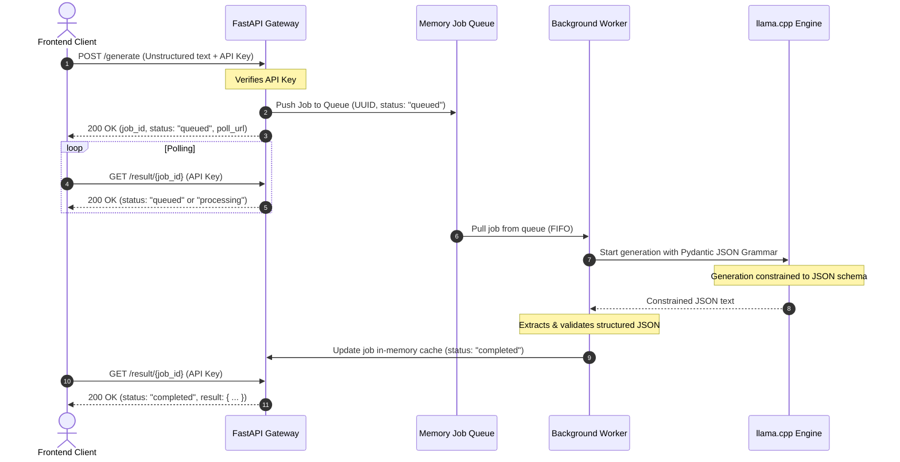

# 🩺 Med Report API

[](https://fastapi.tiangolo.com)
[](https://www.python.org)
[](https://www.docker.com)
[](https://huggingface.co)
[](https://aws.amazon.com/ec2/)

A production-ready, asynchronous REST API serving a fine-tuned **Qwen3 (Qwen 1.5/2.5/3)** medical assistant model on AWS EC2. It accepts unstructured text inputs (like raw doctor notes or patient transcripts) and outputs a highly structured JSON medical report containing symptoms, diagnoses, medications, and clinical notes.

This API uses **llama.cpp** for high-performance GGUF inference, constrained by **JSON Schema Grammar** to guarantee that the output always matches the expected schema. It uses an **in-memory background job queue** so that heavy LLM inference does not block incoming requests.

---

## 🏗️ Architecture & How It Works

To support high concurrency and prevent blocking, the API employs a non-blocking background queue model:



---

## 🛠️ Tech Stack & Core Libraries

- **Inference Engine**: [llama-cpp-python](https://github.com/abetlen/llama-cpp-python) for lightning-fast GGUF model execution.
- **REST Framework**: [FastAPI](https://fastapi.tiangolo.com/) with asynchronous endpoint support.
- **Data Validation & Grammar**: [Pydantic](https://docs.pydantic.dev/) & `LlamaGrammar` to enforce JSON schema.
- **Task Management**: Built-in Python `queue.Queue` with a daemon worker thread.
- **Containerization**: [Docker](https://www.docker.com) multi-stage builds.
- **Deployment & CI/CD**: [GitHub Actions](https://github.com/features/actions) for automated Docker Hub image pushes and AWS EC2 deployments.

---

## 📁 Repository Structure

Below are the main files in this repository:

- [app.py](file:///e:/side%20projects/GP/Report-model-api/app.py): The main FastAPI application including authentication, grammar schemas, job queue, and background worker threads.
- [Dockerfile](file:///e:/side%20projects/GP/Report-model-api/Dockerfile): Optimized container build file that pulls the model from Hugging Face during build.
- [deploy.sh](file:///e:/side%20projects/GP/Report-model-api/deploy.sh): Automatic server setup and deployment script for Ubuntu/Amazon Linux EC2 instances.
- [requirements.txt](file:///e:/side%20projects/GP/Report-model-api/requirements.txt): Python dependencies for the container environment.
- [.env.example](file:///e:/side%20projects/GP/Report-model-api/.env.example): Required environment variables template.
- [.gitignore](file:///e:/side%20projects/GP/Report-model-api/.gitignore): Configured to prevent tracking model files, environment files, local secrets, and keys.

---

## 🔐 Secrets & Security Management

Security is a primary concern. The codebase is configured to avoid exposing sensitive keys and credentials.

### Ignored Sensitive Files
The [.gitignore](file:///e:/side%20projects/GP/Report-model-api/.gitignore) file explicitly ignores the following items to prevent credential leaks:
* **Environment Files**: `.env` and `.env.*` (use [.env.example](file:///e:/side%20projects/GP/Report-model-api/.env.example) to share variable templates).
* **SSH Keys & Private Credentials**: All `.pem`, `.key`, and `.ppk` files.
* **Credentials Folders**: The `forbidden_stuff/` directory (used to store EC2 SSH keys, Putty profiles, and server credentials locally).
* **Security Scans**: `gitleaks-report.json` containing local security scan reports.
* **Model Artifacts**: `.gguf`, `.bin`, `.safetensors`, and the `/model` directory.

### Local Credentials Storage
If you must store server keys (e.g., `med-report-key-2.pem`) locally for SSH-ing, place them inside the `forbidden_stuff/` folder. It is safe from git indexing and will never be pushed to your remote repository.

---

## 📋 Environment Configuration

Create a `.env` file in the root directory based on the [.env.example](file:///e:/side%20projects/GP/Report-model-api/.env.example) template:

```env
HF_TOKEN=your-huggingface-token
HF_REPO_ID=your-username/qwen3-doctor
API_KEY=your-secret-api-key
```

### Configuration Variables

| Variable | Required | Description |
|---|---|---|
| `HF_TOKEN` | Yes (Build-time) | HuggingFace Access Token used to download the fine-tuned model. |
| `HF_REPO_ID` | Yes (Build-time) | HuggingFace Repository ID where your GGUF model is stored (e.g. `ziadmo/qwen3-doctor`). |
| `API_KEY` | Yes (Runtime) | Secret key checked in the HTTP headers (`X-API-Key`) to authenticate client requests. |
| `GGUF_PATH` | No | Overrides the local path to the `.gguf` file inside the docker container. |

---

## 🚀 Deployment Guide

### Manual Setup on AWS EC2
1. **Launch an EC2 Instance** in the AWS console:
   - **AMI**: Ubuntu 24.04 LTS or Amazon Linux 2023.
   - **Instance Type**: `t3.xlarge` (4 vCPU, 16 GB RAM minimum) or any GPU-enabled instance.
   - **Storage**: At least 30 GB gp3 storage.
   - **Security Group**: Inbound TCP rules allowing port `8000` (API) and port `22` (SSH).
   - **Elastic IP**: Allocate and associate an Elastic IP with the instance so that the API host address remains static.
2. **SSH into the Instance**:
   ```bash
   ssh -i "forbidden_stuff/med-report-key-2.pem" ubuntu@<YOUR_ELASTIC_IP>
   ```
3. **Download and Run the Deployment Script**:
   Copy [deploy.sh](file:///e:/side%20projects/GP/Report-model-api/deploy.sh) to the instance, make it executable, and run it:
   ```bash
   export HF_TOKEN="your_hf_token"
   export HF_REPO_ID="your_repo_id"
   export API_KEY="your_secret_api_key"
   
   chmod +x deploy.sh
   ./deploy.sh
   ```

### CI/CD Deployment Flow
Whenever code is pushed to the `main` branch, a GitHub Actions workflow builds a new Docker image, logs into Docker Hub, and pushes the image.
The deployment pipeline configuration is located in [.github/workflows/deploy.yml](file:///e:/side%20projects/GP/Report-model-api/.github/workflows/deploy.yml).

To pull the latest image and update a running container on your EC2 instance, use the instructions in [How to Update the AI Model Docker Container on EC2 Mahcine.md](file:///e:/side%20projects/GP/Report-model-api/Docs_for_deployment_notes/How%20to%20Update%20the%20AI%20Model%20Docker%20Container%20on%20EC2%20Mahcine.md).

---

## 📡 API Reference & Integration

### Base URL
```
http://<YOUR_EC2_ELASTIC_IP>:8000
```

### Headers
Every request except the `/health` check requires the API key header:
```http
X-API-Key: <your-secret-api-key>
```

---

### Endpoints

#### 1. Submit Generation Job
Submit raw text to initiate model processing.

- **Method**: `POST`
- **Path**: `/generate`
- **Request Body**:
  ```json
  {
    "text": "Patient is a 45-year-old male presenting with acute substernal chest pain radiating down the left arm, starting 2 hours ago. Accompanied by mild dyspnea and diaphoresis. Prior history of hypertension managed on lisinopril. Currently taking no other medications.",
    "max_tokens": 512
  }
  ```
- **Response (200 OK)**:
  ```json
  {
    "job_id": "8f828a21-9dbb-4fc6-b8b8-67503fa6f212",
    "status": "queued",
    "poll_url": "/result/8f828a21-9dbb-4fc6-b8b8-67503fa6f212"
  }
  ```

#### 2. Get Job Status and Result
Poll for status and fetch the completed structured medical report.

- **Method**: `GET`
- **Path**: `/result/{job_id}`
- **Response (Processing)**:
  ```json
  {
    "job_id": "8f828a21-9dbb-4fc6-b8b8-67503fa6f212",
    "status": "processing"
  }
  ```
- **Response (Completed)**:
  ```json
  {
    "job_id": "8f828a21-9dbb-4fc6-b8b8-67503fa6f212",
    "status": "completed",
    "result": {
      "symptoms": [
        {
          "symptom": "substernal chest pain",
          "severity": "acute",
          "duration": "2 hours"
        },
        {
          "symptom": "dyspnea",
          "severity": "mild",
          "duration": "2 hours"
        },
        {
          "symptom": "diaphoresis",
          "severity": "moderate",
          "duration": "2 hours"
        }
      ],
      "old_diagnosis": [
        "hypertension"
      ],
      "medication": [
        {
          "name": "lisinopril",
          "dosage": null,
          "frequency": null
        }
      ],
      "notes": "Patient presents with symptoms highly suggestive of acute coronary syndrome. Immediate ECG and cardiac enzymes recommended."
    }
  }
  ```
- **Response (Failed)**:
  ```json
  {
    "job_id": "8f828a21-9dbb-4fc6-b8b8-67503fa6f212",
    "status": "failed",
    "error": "Timeout occurred during inference"
  }
  ```

#### 3. Health Check
Check queue status and system load instantly.

- **Method**: `GET`
- **Path**: `/health`
- **Response (200 OK)**:
  ```json
  {
    "status": "ok",
    "queue_size": 0,
    "total_jobs": 0
  }
  ```

---

## 💻 Client Code Examples

### JavaScript (Async Polling Example)

```javascript
const generateMedicalReport = async (inputText) => {
  const BASE_URL = "http://<YOUR_EC2_ELASTIC_IP>:8000";
  const HEADERS = {
    "Content-Type": "application/json",
    "X-API-Key": "your-secret-api-key"
  };

  // 1. Submit the job
  const response = await fetch(`${BASE_URL}/generate`, {
    method: "POST",
    headers: HEADERS,
    body: JSON.stringify({ text: inputText, max_tokens: 512 })
  });

  if (!response.ok) {
    throw new Error(`Submission failed: ${response.statusText}`);
  }

  const { job_id } = await response.json();

  // 2. Poll until completion
  while (true) {
    const pollResponse = await fetch(`${BASE_URL}/result/${job_id}`, {
      headers: { "X-API-Key": "your-secret-api-key" }
    });
    const jobData = await pollResponse.json();

    if (jobData.status === "completed") {
      return jobData.result;
    } else if (jobData.status === "failed") {
      throw new Error(`Model generation failed: ${jobData.error}`);
    }

    // Wait 2 seconds before polling again
    await new Promise((resolve) => setTimeout(resolve, 2000));
  }
};
```

### Python (Async Polling Example)

```python
import requests
import time

def generate_medical_report(input_text: str):
    base_url = "http://<YOUR_EC2_ELASTIC_IP>:8000"
    headers = {"X-API-Key": "your-secret-api-key"}
    
    # 1. Submit the job
    res = requests.post(
        f"{base_url}/generate",
        headers=headers,
        json={"text": input_text, "max_tokens": 512}
    )
    res.raise_for_status()
    job_id = res.json()["job_id"]
    
    # 2. Poll until completion
    while True:
        status_res = requests.get(f"{base_url}/result/{job_id}", headers=headers).json()
        status = status_res["status"]
        
        if status == "completed":
            return status_res["result"]
        elif status == "failed":
            raise RuntimeError(f"Job failed: {status_res.get('error')}")
            
        time.sleep(2)
```